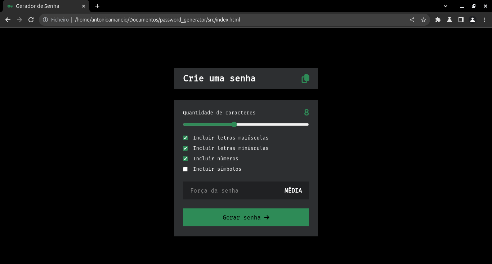

## Descrição em Português 🌍

# Gerador de senha 🔑

O gerador de senha, como o próprio nome já diz, é um app que tem a função de criar senhas. Esse app em específico permite criar senhas aleatórias actravés de filtros como, a quantidade de caracteres que queremos que a nossa senha tenha e também os tipos de caracteres, como letras maiúsculas, minúsculas, números e símbolos. O app também nos informa se a nossa senha é forte, média ou fraca e por fim o app permite copiar rapidamente a senha para utilizar logo de seguida.

Essa aplicação pode ser usada por qualquer pessoa. Você pode ter acesso a ela copiando e colando o link no seu navegador. Actravés da aba de links.

## 🔗 Links

<a href="https://antonioamandio.github.io/password_generator/src/index.html">https://antonioamandio.github.io/password_generator/src/index.html</a>

## Screenshots

## Description in English 🌍

# Password generator 🔑

The password generator, as the name suggests, is an app that has the function of creating passwords. This specific app allows you to create random passwords using filters such as the number of characters we want our password to have and also the types of characters, such as uppercase letters, lowercase letters, numbers and symbols. The app also informs us whether our password is strong, medium or weak and finally the app allows us to quickly copy the password to use immediately.

This application can be used by anyone. You can access it by copying and pasting the link into your browser. Through the links tab.
